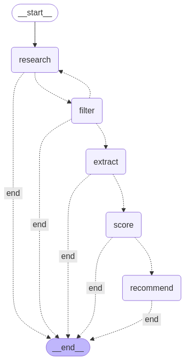

# Stock Sage: AI-Powered Stock Analysis Agent

Stock Sage is an intelligent agent-based system that provides short-term stock investment recommendations by analyzing the latest financial news, reports, and analyst opinions. Built with LangChain, LangGraph, and modern LLM technology, Stock Sage demonstrates the power of agentic AI for financial analysis.

## 🚀 Features

- **Multi-Agent Framework**: Coordinated system of specialized agents for research, filtering, extraction, scoring, and recommendation
- **Real-Time Web Research**: Gathers the latest financial information using Tavily Search API
- **Intelligent Filtering**: Identifies relevant content from financial news and reports
- **Structured Insight Extraction**: Transforms unstructured text into actionable financial insights
- **Comprehensive Scoring**: Evaluates stocks across multiple financial dimensions
- **Clear Investment Recommendations**: Provides actionable investment advice with supporting evidence
- **Interactive Web UI**: User-friendly Streamlit interface for analysis and visualization

## 🏗️ Architecture Overview

The system is built on a modular agent architecture, leveraging LangChain and LangGraph for orchestration:

```
┌─────────────────┐    ┌─────────────────┐    ┌─────────────────┐    ┌─────────────────┐    ┌─────────────────┐
│                 │    │                 │    │                 │    │                 │    │                 │
│  Research Agent │───▶│ Filtering System│───▶│ Extraction Agent│───▶│Scoring Mechanism│───▶│Recommendation   │
│                 │    │                 │    │                 │    │                 │    │     Agent       │
└─────────────────┘    └─────────────────┘    └─────────────────┘    └─────────────────┘    └─────────────────┘
```


## 🧠 AI Agent Development

### Agent Components

1. **Research Agent (`research.py`)**
   - Uses Tavily Search API to gather recent financial information
   - Focuses search on relevant financial data, analyst reports, and news
   - Implemented with OpenAI function calling for structured outputs
   - Key LangChain Components: `TavilySearchResults`, `AgentExecutor`, `ChatOpenAI`

2. **Filtering System (`filtering.py`)**
   - Evaluates search results for relevance to financial analysis
   - Implements rule-based, date-based, and semantic-based filtering
   - Extracts content from web pages with BeautifulSoup
   - Key Components: `LLMChain`, `ChatPromptTemplate`

3. **Extraction Agent (`extraction.py`)**
   - Transforms unstructured text into structured financial insights
   - Uses function calling to enforce structured schema
   - Produces concise summaries of financial information
   - Key Components: `OpenAIFunctions`, `JsonOutputFunctionsParser`

4. **Scoring Mechanism (`scoring.py`)**
   - Evaluates stocks across multiple financial dimensions
   - Implements Pydantic schema for consistent scoring
   - Provides reasoning for each score component
   - Key Components: `PydanticOutputParser`, `StockScore` (Pydantic model)

5. **Recommendation Agent (`recommendation.py`)**
   - Generates comprehensive investment recommendations
   - Synthesizes scores and insights into actionable advice
   - Includes risk assessment and investment rationale
   - Key Components: `LLMChain`, `PromptTemplate`

### Workflow Orchestration

The system uses LangGraph's `StateGraph` for workflow orchestration:

- **State Management**: Uses `TypedDict` for structured state passing between nodes
- **Conditional Routing**: Implements decision nodes for adaptive workflow paths
- **Error Handling**: Graceful recovery from failures at any stage
- **Retry Logic**: Smart retries for research when results are insufficient


# 🔄 CI/CD and Deployment

### Containerization

The application is containerized using Docker with separate containers for:
- **Backend**: Python Flask API hosting the LangChain/LangGraph agents
- **Frontend**: Streamlit web interface for user interaction

Each component has its own Dockerfile:
- `backend/Dockerfile`: Builds the agent backend
- `frontend/Dockerfile`: Builds the Streamlit UI

### CI/CD Pipeline

Continuous integration and deployment is handled through Google Cloud Build:

The pipeline:
1. Builds Docker images for backend and frontend
2. Pushes images to Google Container Registry
3. Updates Kubernetes deployments with new images
4. Tags images for versioning

### Kubernetes Deployment

The application is deployed on GKE (Google Kubernetes Engine):

- **Backend Deployment**: Scales agent processing with multiple replicas
- **Frontend Deployment**: Exposes the UI through a LoadBalancer
- **Secret Management**: Secure storage of API keys via Kubernetes secrets
- **Resource Management**: Appropriate CPU and memory limits for each component


### Local Development

For local development and testing:

1. Clone the repository
2. Set up environment variables in `.env` file
3. Run using Docker Compose:

```bash
docker compose up --build
```

## 📊 Key Design Considerations

### Agent Design Principles

- **Single-Responsibility**: Each agent focuses on one specific task
- **Loose Coupling**: Agents communicate via well-defined interfaces
- **Fault Tolerance**: Error handling at each stage of processing
- **Observability**: Comprehensive logging for monitoring and debugging
- **Statelessness**: Agents don't maintain state between requests (beyond caching)

### LLM Integration Strategies

- **Structured Output Parsing**: Using schemas to ensure consistent outputs
- **Prompt Engineering**: Carefully designed prompts with clear instructions
- **Model Selection**: Using appropriate models for different tasks
- **Cost Management**: Optimized token usage through filtering and chunking

### Security and Cost Management

- **Rate Limiting**: Built-in throttling to manage API costs
- **Caching**: Results cached where appropriate to minimize API calls
- **Content Filtering**: Early filtering reduces LLM token usage

## 🛠️ Technologies Used

- **Core AI/ML**: LangChain, LangGraph, OpenAI GPT models
- **Web Search**: Tavily Search API
- **Backend**: Python, Flask
- **Frontend**: Streamlit, Plotly
- **DevOps**: Docker, Kubernetes, GKE, Google Cloud Build
- **Web Scraping**: BeautifulSoup, Requests

## 🚶 Getting Started

### Prerequisites

- Python 3.10
- Docker and Docker Compose
- OpenAI API key
- Tavily API key

### Installation

1. Clone the repository:
```bash
git clone https://github.com/yourusername/stock-sage.git
cd stock-sage
```

2. Create a `.env` file with your API keys:
```
OPENAI_API_KEY=your_openai_api_key
TAVILY_API_KEY=your_tavily_api_key
LLM_MODEL=gpt-4o-mini
```

3. Run the application locally:
```bash
docker-compose up --build
```

4. Access the UI at http://localhost:8501

## 📚 Future Improvements

- **Monitoring**: Exhaustive monitoring to be implemented
- **Enhanced Financial Models**: Integration with quantitative financial models
- **Technical Analysis**: Addition of chart pattern recognition
- **Portfolio Optimization**: Improved allocation recommendations
- **Historical Backtesting**: Validate recommendations against historical data
- **User Customization**: Personalized investment criteria and risk profiles

## 📝 License

This project is licensed under the MIT License - see the LICENSE file for details.

## 🙏 Acknowledgements

- LangChain and LangGraph teams for their excellent frameworks
- OpenAI for GPT API access
- Tavily for their search API